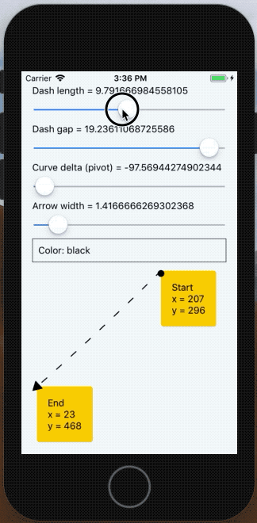

react-native-arrow-view
-----------------------
`ArrowView` component for drawing pointers between components easely



Install
-------
```bash
npm install --save react-native-arrow-view
```
or
```bash
yarn add react-native-arrow-view
```

For iOS you should add to your Podspec next line:
```ruby
pod 'React-ART', :path => '../node_modules/react-native/Libraries/ART'
```

Example
-------

Add `ArrowView` to render function, pass to it absolute coordinates for drawing it self position.
```js
import { ArrowView } from 'react-native-arrow-view'

render() {
  return(
    <ArrowView
      from={{ x: 0, y: 0 }}
      to={{ x: 100, y: 100 }}
      // dash={[5, 10]} // optional: for define [dashLength, dashGap] 
      // color={color} // optional: color of arrow
      // curveDelta={curveDelta} // optional: for add more accuaracy
      // width={width} // optional: width of arrow lines
    />
  )
}
```

If you dont know coordinates of your view, you can use `Measurable` component, that can calculate it for you
```js
import { View, Text } from 'react-native'
import { ArrowView, Measurable } from 'react-native-arrow-view'

render() {
  return(
    <View>
      <ArrowView
        from={this.state.fromCoordinates}
        to={this.state.toCoordinates}
      />

      <Measurable onMeasure={(x: number, y: number, width: number, height: number) => {
        this.setState({
          fromCoordinates: {
            x, y, width, height
          }
        })
      }}>
        <Text>From</Text>
      </Measurable>

      <Measurable onMeasure={(x: number, y: number, width: number, height: number) => {
        this.setState({
          toCoordinates: {
            x, y, width, height
          }
        })
      }}>
        <Text>To</Text>
      </Measurable>
    </View>
  )
}
```

Also, you can modify your arrow position for more flexible configuration.

If you have a question or need specific feature, feel free to [open an issue](https://github.com/lamantin-group/react-native-arrow-view/issues/new) or create pull request.
---

```
The MIT License

Copyright (c) 2010-2019 Lamantin Group, LTD. https://lamantin.group

Permission is hereby granted, free of charge, to any person obtaining a copy
of this software and associated documentation files (the "Software"), to deal
in the Software without restriction, including without limitation the rights
to use, copy, modify, merge, publish, distribute, sublicense, and/or sell
copies of the Software, and to permit persons to whom the Software is
furnished to do so, subject to the following conditions:

The above copyright notice and this permission notice shall be included in
all copies or substantial portions of the Software.

THE SOFTWARE IS PROVIDED "AS IS", WITHOUT WARRANTY OF ANY KIND, EXPRESS OR
IMPLIED, INCLUDING BUT NOT LIMITED TO THE WARRANTIES OF MERCHANTABILITY,
FITNESS FOR A PARTICULAR PURPOSE AND NONINFRINGEMENT. IN NO EVENT SHALL THE
AUTHORS OR COPYRIGHT HOLDERS BE LIABLE FOR ANY CLAIM, DAMAGES OR OTHER
LIABILITY, WHETHER IN AN ACTION OF CONTRACT, TORT OR OTHERWISE, ARISING FROM,
OUT OF OR IN CONNECTION WITH THE SOFTWARE OR THE USE OR OTHER DEALINGS IN
THE SOFTWARE.
```